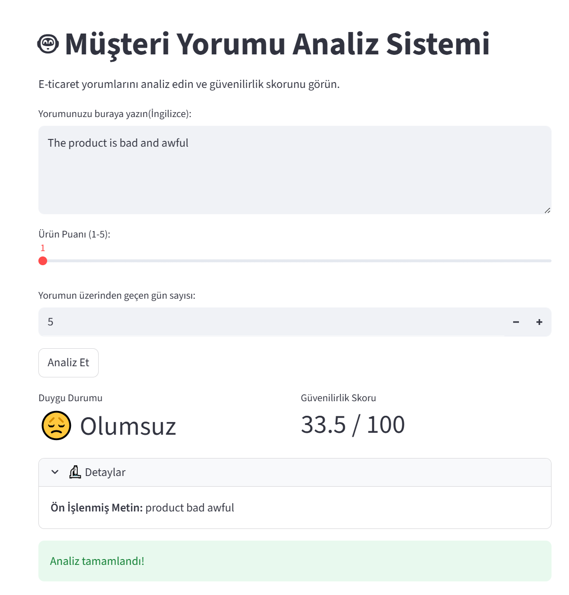
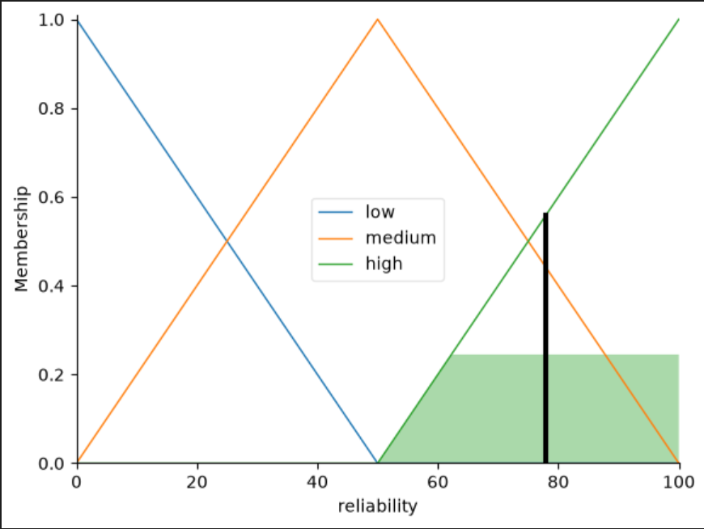
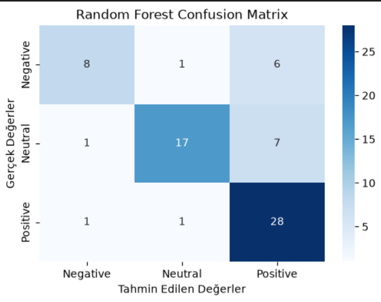
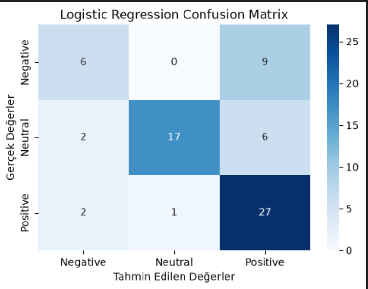
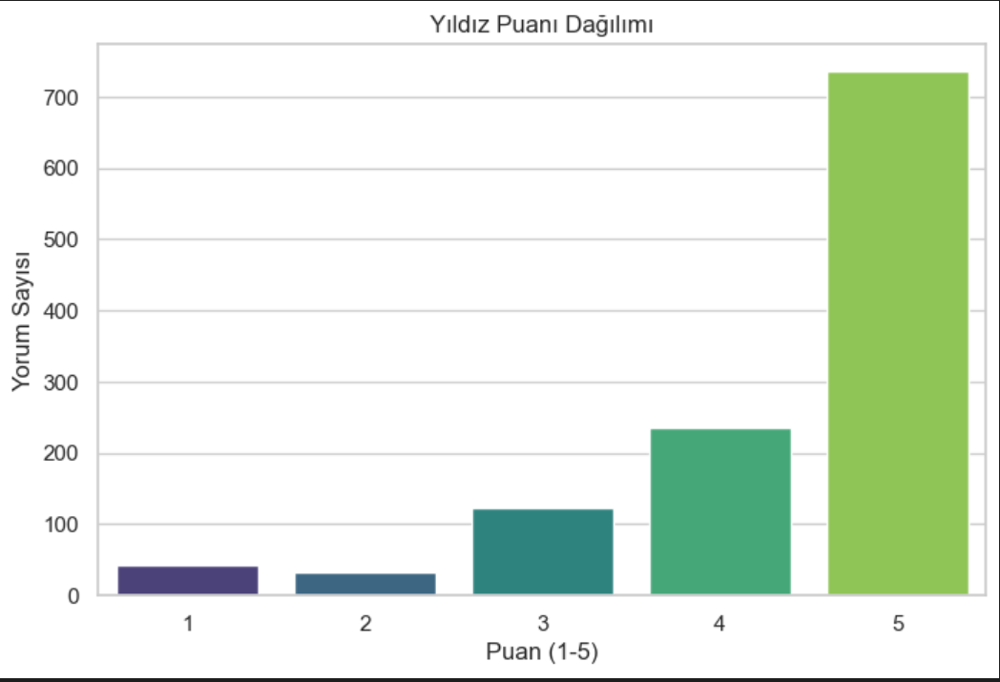
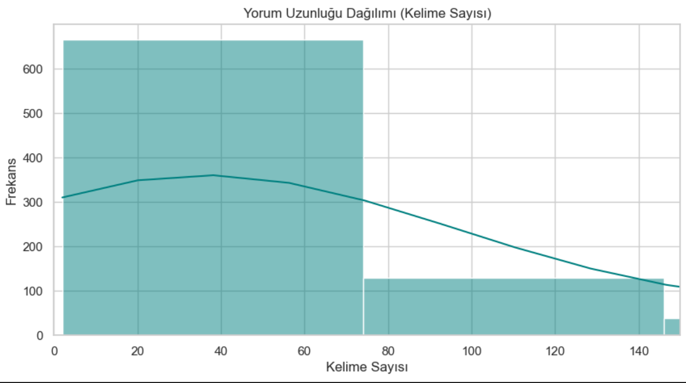
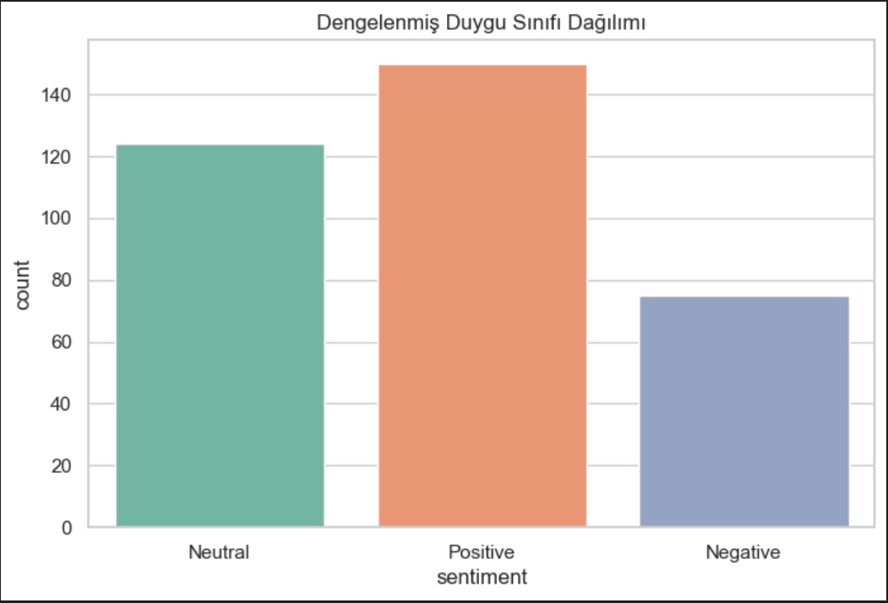

# Customer Review Analysis System (NLP & Fuzzy Logic)

This project is an integrated artificial intelligence solution developed to automatically analyze customer reviews on e-commerce platforms, perform sentiment classification, and generate reliability scores based on Fuzzy Logic.

## 📋 Project Summary
* **Sentiment Analysis:** Determines whether reviews are positive, negative, or neutral using machine learning algorithms.
* **Reliability Scoring:** Calculates "review reliability" using parameters such as review length, product rating, and publication date.
* **Business-Oriented Pipeline:** Provides an infrastructure that enables the automatic generation of "complaint summaries" based on analyzed data.

## 📊 Visualizations and Model Performance
**1. Streamlit User Interface**


**2. Fuzzy Logic Membership Example**


**3. Model Performances (Confusion Matrices)**
*Random Forest Classifier:*


*Logistic Regression Classifier:*


**4. Exploratory Data Analysis (EDA)**
*Rating Distribution:*


*Comment Length Distribution:*


*Balanced Sentiment Classes:*


## 📂 Technical Architecture and File Structure
The system is built on a sustainable and modular structure:

```text
piton-nlp-fuzzy-case/
├── app/
│   └── main.py             # Streamlit-based interactive user interface
├── data/
│   ├── raw/                # Original Kaggle dataset (7817_1.csv)(https://www.kaggle.com/datasets/yasserh/amazon-product-reviews-dataset)
│   └── processed/          # Cleaned and balanced data
├── models/                 # Trained .pkl models and vectorizers
├── notebooks/              # Step-by-step data analysis and modeling processes
└── src/                    # Modular source code
    ├── data_processor.py   # NLP preprocessing (Regex, Lemmatization, Stop-words)
    ├── sentiment_model.py  # Prediction engine (Random Forest/Logistic Regression)
    └── fuzzy_inference.py  # Scikit-fuzzy based reliability system
🛠 Technical Choices and Justifications
NLP Preprocessing: Text cleaning was performed using the NLTK library, applying steps such as lowercasing, punctuation removal, stop-word elimination, and lemmatization.

Vectorization: TF-IDF method was selected to optimize semantic distinctiveness and handle the sparse matrix formation in high-dimensional text data.

Model: Random Forest Classifier was selected as the core model due to its success in capturing complex non-linear patterns in text data and its overall performance achieved through hyperparameter optimization.

Fuzzy Logic: scikit-fuzzy was utilized to mathematically model subjective and uncertain concepts such as "review reliability."


🚀 Setup (Installation)
Clone the repository:

Bash
git clone [https://github.com/ZekiKurt0/NLP-Fuzzy-Case](https://github.com/ZekiKurt0/NLP-Fuzzy-Case)
cd  nlp-fuzzy-case
Create a Virtual Environment:

Bash
# Windows
python -m venv venv
venv\Scripts\activate

# Linux/macOS
python3 -m venv venv
source venv/bin/activate
Install Dependencies:

Bash
pip install -r requirements.txt
Run the Application:

Bash
streamlit run app/main.py
Developer: Muhammed Zeki Kurt | Contact: m.zekikurtt@gmail.com